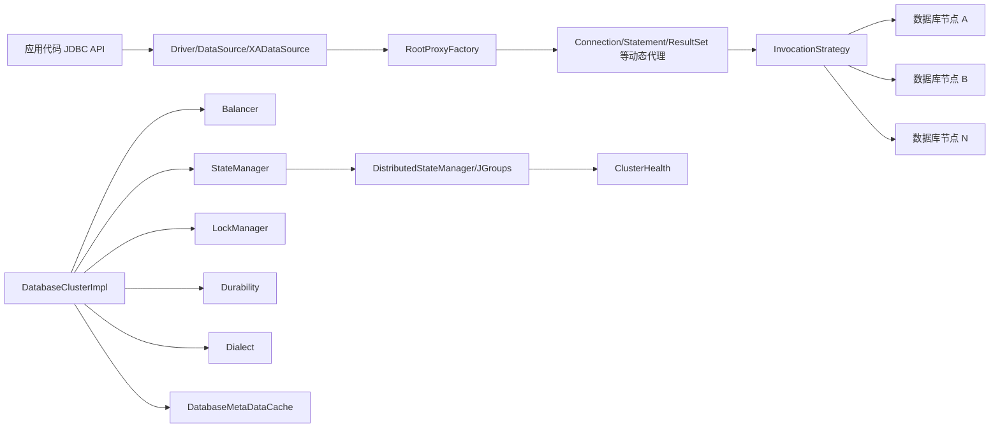
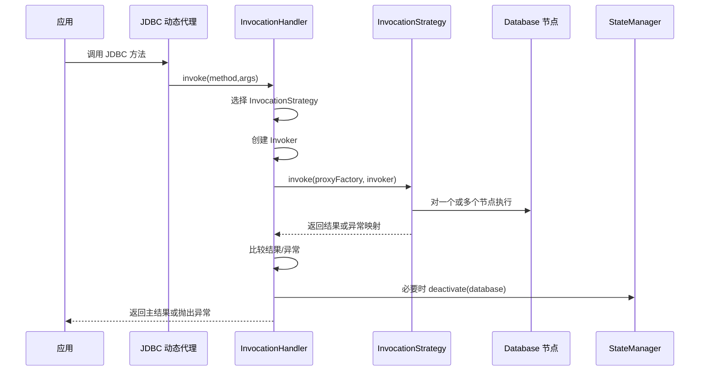
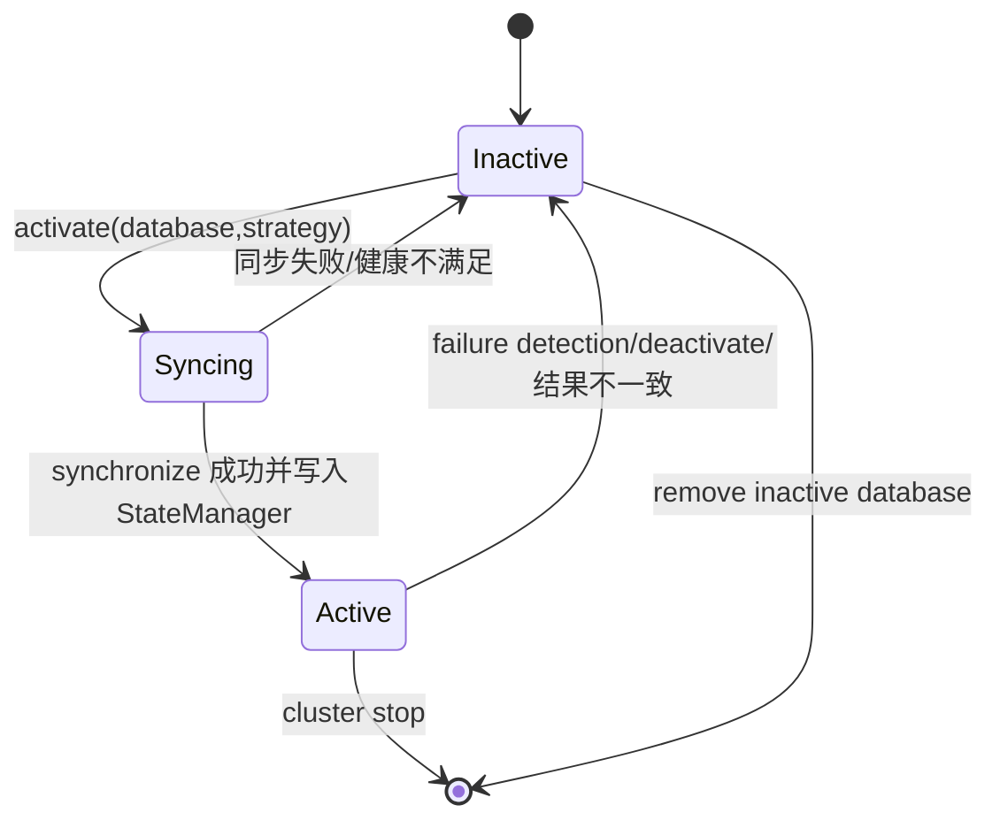
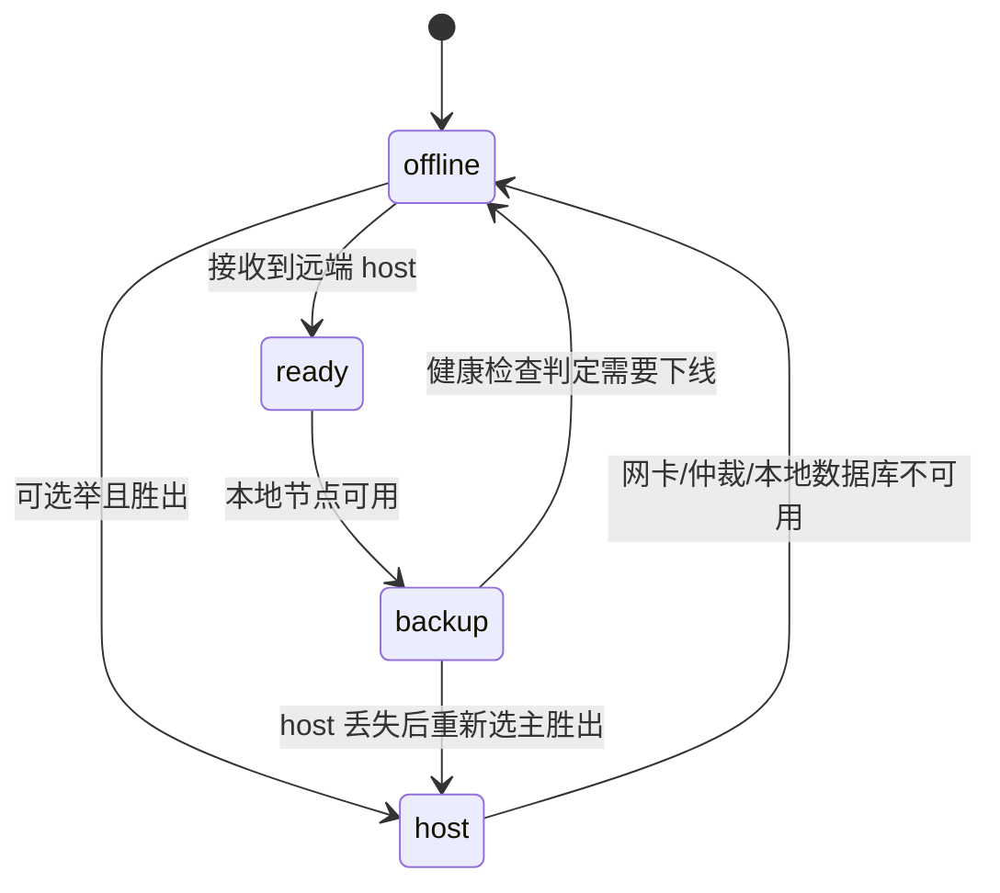

# HA-JDBC2 设计文档

## 背景

HA-JDBC2 是一个基于 JDBC API 的高可用数据库访问代理库。应用侧仍通过 `java.sql.Driver`、`javax.sql.DataSource`、`ConnectionPoolDataSource` 或 `XADataSource` 访问数据库，HA-JDBC2 在这些入口之下维护一组同构数据库节点，并通过动态代理、调用策略、状态管理、锁、同步策略和分布式通信来实现读负载均衡、写复制、故障摘除、节点恢复和可选的跨 JVM 协调。

本设计文档基于当前代码扫描生成，主要描述现有架构与关键约束，不包含新的功能改造方案。

## 目标

- 梳理项目当前模块边界、组件装配关系和核心运行流程。
- 明确 JDBC 调用在多数据库节点上的路由、同步、故障处理和结果一致性判断方式。
- 记录配置、SPI 扩展点、状态管理、分布式锁和健康检测的现状设计。
- 给后续维护、重构、测试补齐和问题定位提供可执行的代码地图。

## 非目标

- 不改变现有 Java 代码行为。
- 不重新设计数据库复制协议或事务一致性协议。
- 不替代用户文档中的部署、XML 配置示例和使用说明。
- 不评价许可证、发布流程或 Maven Central 发布配置是否合理。

## 扫描范围

| 类型 | 路径 |
| --- | --- |
| 构建配置 | `build.gradle`, `settings.gradle`, `gradle.properties` |
| 主代码 | `src/main/java/net/sf/hajdbc/**` |
| 运行资源 | `src/main/resources/**` |
| 站点文档 | `src/site/markdown/**`, `src/site/resources/**` |
| 测试代码 | `src/test/java/**`, `src/test/resources/**` |

## 总体架构

HA-JDBC2 的核心抽象是 `DatabaseCluster<Z, D extends Database<Z>>`。其中 `Z` 代表底层连接源类型，例如 `java.sql.Driver` 或 `javax.sql.DataSource`，`D` 代表对应的数据库节点描述对象。

### 模块职责

| 模块 | 主要职责 |
| --- | --- |
| `net.sf.hajdbc.sql` | JDBC 入口、动态代理、代理工厂、调用处理器、事务上下文、JAXB 配置对象 |
| `net.sf.hajdbc.invocation` | 调用策略、单节点/多节点执行、结果收集、失败判断、事务执行器 |
| `net.sf.hajdbc.balancer` | 活跃数据库集合和读请求节点选择，支持 simple/random/round-robin/load |
| `net.sf.hajdbc.state` | 活跃库状态、耐久化事件恢复、分布式状态广播 |
| `net.sf.hajdbc.lock` | 本地和分布式命名读写锁，全局锁用 `null` 表示 |
| `net.sf.hajdbc.sync` | 节点激活前的数据同步策略 |
| `net.sf.hajdbc.durability` | 事务调用记录、崩溃恢复和部分提交识别 |
| `net.sf.hajdbc.dialect` | 数据库方言、SQL 生成、失败异常判断、dump/restore 能力 |
| `net.sf.hajdbc.cache` | 数据库元数据缓存 |
| `net.sf.hajdbc.distributed` | JGroups 命令分发、成员管理和状态传输 |
| `net.sf.hajdbc.state.health` | 节点健康、主备状态、心跳、选主、可写性判断 |
| `net.sf.hajdbc.management` | 注解式 JMX MBean 注册 |
| `net.sf.hajdbc.codec` | 配置密码解码和加密密码支持 |
| `net.sf.hajdbc.io` | LOB/InputStream/Reader 参数复用和临时落盘策略 |

## 核心约束

| 约束 | 当前设计 |
| --- | --- |
| JDBC 透明性 | 对外暴露标准 JDBC 接口，内部用 `java.lang.reflect.Proxy` 生成代理 |
| 数据库同构 | 集群内数据库应具有一致 schema 和兼容数据内容 |
| 写一致性 | 写类操作默认分发到多个活跃节点，结果或异常不一致时摘除异常节点 |
| 读扩展 | 只读查询根据隔离级别、锁和 `SELECT FOR UPDATE` 情况选择单节点或多节点 |
| 节点恢复 | 激活前需要持有写锁并按同步策略追平目标数据库 |
| 分布式协作 | 配置 `distributable` 后使用 JGroups 进行状态、锁、健康和命令传播 |
| 方言绑定 | 异常是否代表数据库故障、序列/自增/锁 SQL 等行为由 `Dialect` 决定 |
| 兼容性 | 构建配置通过 `jdkVersion` 控制 source/target；站点文档仍描述 Java 1.6+，需以实际构建参数为准 |

## 现状/已有流程

### 启动流程

`DatabaseClusterImpl.start()` 是集群运行时装配入口。

1. 从 `DatabaseClusterConfiguration` 创建 `Decoder`、`LockManager`、`StateManager`。
2. 如果存在 `CommandDispatcherFactory`，则用 `DistributedLockManager` 和 `DistributedStateManager` 包装本地锁与状态管理。
3. 创建 `Balancer`、`Dialect`、`Durability`、`ExecutorService` 和 `InputSinkStrategy`。
4. 启动锁管理器和状态管理器。
5. 识别本地数据库节点：通过本机 IP 与数据库配置中的 `ip` 匹配。
6. 从状态管理器恢复活跃数据库集合；如果没有活跃库，尝试激活本地可用库。
7. 恢复未完成的 durability 事件。
8. 创建并刷新元数据缓存。
9. 注册故障检测与自动激活定时任务。
10. 注册 JMX MBean。

### 停止流程

`DatabaseClusterImpl.stop()` 会标记集群非活跃、注销 MBean、停止定时任务、停止状态/锁管理器、关闭执行器并清空 balancer。当前代码中“停止时主动摘除本地数据库”的逻辑被注释保留，原因是尚不能区分嵌入式数据库与独立进程数据库。

### JDBC 调用流程

### 读写路由

| 场景 | 入口代码 | 策略 |
| --- | --- | --- |
| `Object`/`Wrapper` 等本地语义方法 | `AbstractInvocationHandler` | `INVOKE_ON_ANY` |
| 连接只读属性读取 | `ConnectionInvocationHandler` | `INVOKE_ON_ANY` |
| `Connection.getMetaData()` / `isValid()` | `ConnectionInvocationHandler` | `INVOKE_ON_NEXT` |
| 创建 `Statement` | `ConnectionInvocationHandler` | `INVOKE_ON_EXISTING` |
| 创建 `PreparedStatement` / `CallableStatement` | `ConnectionInvocationHandler` | `INVOKE_ON_ALL` |
| 只读 `executeQuery` 且无锁、非 `SELECT FOR UPDATE` | `AbstractStatementInvocationHandler` | 隔离级别 >= `REPEATABLE_READ` 时主库，否则下一个节点 |
| 写 SQL / batch / `SELECT FOR UPDATE` | `AbstractStatementInvocationHandler` | 带锁的 `TRANSACTION_INVOKE_ON_ALL` |
| `commit` / `rollback` / `setAutoCommit` | `ConnectionInvocationHandler` | `END_TRANSACTION_INVOKE_ON_ALL` |
| `XAResource` 事务阶段 | `XAResourceInvocationHandler` | 按 XA 方法映射到 all/any/transaction/end-transaction |

### 失败处理

`InvokeOnAnyInvocationStrategy` 和 `InvokeOnManyInvocationStrategy` 负责将底层异常转换为对应异常类型，并通过 `ExceptionFactory.indicatesFailure(exception, dialect)` 判断是否属于数据库故障。

- 单节点读失败：如果异常表示数据库故障且还有其他活跃节点，则摘除当前数据库并尝试其他节点。
- 多节点调用失败：按结果和异常进行一致性判断；故障类异常节点可摘除；如果主节点异常或非故障异常不一致，按主结果/主异常决定返回或抛出。
- 结果不一致：`AbstractInvocationHandler.createResult()` 会摘除返回值不同于主结果的节点。

## 接口设计

### 核心接口

| 接口 | 关键方法 | 说明 |
| --- | --- | --- |
| `DatabaseCluster` | `start/stop`, `activate/deactivate`, `getBalancer`, `getStateManager`, `getLockManager` | 集群运行时总线 |
| `DatabaseClusterConfiguration` | `getDatabaseMap`, `get*Factory`, `get*Expression` | 组件装配和 XML/编程式配置来源 |
| `Database` | `connect`, `getConnectionSource`, `decodePassword`, `isLocal/isActive` | 数据库节点描述与连接创建 |
| `InvocationStrategy` | `invoke(ProxyFactory, Invoker)` | JDBC 方法调用路由策略 |
| `ProxyFactory` | `get`, `entries`, `record`, `replay` | 管理每个数据库节点对应的真实 JDBC 对象 |
| `StateManager` | `getActiveDatabases`, `recover`, `isValid` | 活跃库与 durability 事件状态 |
| `LockManager` | `readLock`, `writeLock`, `onlyLock` | 命名读写锁和独占锁 |
| `SynchronizationStrategy` | `synchronize(SynchronizationContext)` | 激活前数据同步 |
| `Dialect` | SQL 生成、异常判断、特性识别 | 数据库厂商差异适配 |

### 配置入口

当前支持两类配置来源：

- XML 配置：`XMLDatabaseClusterConfigurationFactory` 按 `config` 属性、系统属性 `ha-jdbc.<cluster-id>.configuration` 或默认 `ha-jdbc-{0}.xml` 搜索资源。
- 编程式配置：`SimpleDatabaseClusterConfigurationFactory` 直接包装 `DatabaseClusterConfiguration`。

JAXB 根配置类包括：

| 访问模式 | 配置类 | 数据库节点类 |
| --- | --- | --- |
| Driver | `DriverDatabaseClusterConfiguration` | `DriverDatabase` |
| DataSource | `DataSourceDatabaseClusterConfiguration` | `DataSourceDatabase` |
| ConnectionPoolDataSource | `ConnectionPoolDataSourceDatabaseClusterConfiguration` | `ConnectionPoolDataSourceDatabase` |
| XADataSource | `XADataSourceDatabaseClusterConfiguration` | `XADataSourceDatabase` |

### SPI 扩展点

项目通过 `META-INF/services` 暴露扩展点：

| 扩展点 | 内置实现 |
| --- | --- |
| `BalancerFactory` | `load`, `random`, `round-robin`, `simple` |
| `DatabaseMetaDataCacheFactory` | `eager`, `shared-eager`, `lazy`, `shared-lazy`, `simple` |
| `CodecFactory` | `simple`, `base64`, `hex`, `crypto` |
| `DialectFactory` | `standard`, `db2`, `derby`, `firebird`, `h2`, `hsqldb`, `ingres`, `maxdb`, `mckoi`, `mysql`, `oracle`, `postgresql`, `sybase` |
| `CommandDispatcherFactory` | `jgroups` |
| `DurabilityFactory` | `none`, `coarse`, `fine` |
| `InputSinkProvider` | `file`, `simple` |
| `LockManagerFactory` | `semaphore` |
| `StateManagerFactory` | `sql`, `berkeleydb`, `sqlite`, `simple` |
| `SynchronizationStrategy` | `full`, `diff`, `fast-diff`, `dump-restore`, `passive` |
| `LoggingProvider` | `slf4j`, `commons`, `jdk` |

## 数据结构

### 集群运行时对象

| 数据 | 所属类 | 语义 |
| --- | --- | --- |
| `id` | `DatabaseClusterImpl` | 集群标识 |
| `configuration` | `DatabaseClusterImpl` | 配置与工厂集合 |
| `balancer` | `DatabaseClusterImpl` | 当前活跃数据库集合和读节点选择 |
| `stateManager` | `DatabaseClusterImpl` | 活跃库状态和 durability 状态 |
| `lockManager` | `DatabaseClusterImpl` | 本地或分布式锁 |
| `databaseMetaDataCache` | `DatabaseClusterImpl` | 表、列、约束、序列等元数据缓存 |
| `durability` | `DatabaseClusterImpl` | 事务阶段事件记录与恢复 |
| `executor` | `DatabaseClusterImpl` | 多节点调用和异步关闭使用的线程池 |

### 状态管理数据

| 数据 | 类型 | 说明 |
| --- | --- | --- |
| 活跃数据库集合 | `Set<String>` | `StateManager.getActiveDatabases()` 返回数据库 ID 集合 |
| 调用事件 | `InvocationEvent` | 一次集群级调用记录 |
| 节点调用事件 | `InvokerEvent` | 某次调用在单个数据库节点上的执行记录 |
| 远端事件表 | `Map<Member, Map<InvocationEvent, Map<String, InvokerEvent>>>` | `DistributedStateManager` 用于成员移除后的恢复 |

### 健康状态数据

| 数据 | 所属类 | 说明 |
| --- | --- | --- |
| `NodeState` | `state.distributed` | 节点状态，当前代码使用 `offline`、`ready`、`backup`、`host` 等状态 |
| `NodeHealth` | `state.health` | 当前节点状态、token、活跃 DB 集合、仲裁 token 等 |
| `Arbiter` / `TokenStore` | `state.health` | 主节点选举与可观测性判断使用的本地/仲裁 token |
| `ClusterHealthImpl.host` | `Member` | 当前主节点成员 |

## 状态机

### 数据库节点状态

### 分布式节点状态

## 时序流程

### 数据库激活

1. 校验目标数据库存活，并通过 `StateManager.isValid(database)` 校验分布式成员有效性。
2. 远程数据库需要对应成员在线且健康状态不为 `offline`；本地数据库需要本节点健康状态不为 `offline`。
3. 获取全局写锁 `lockManager.writeLock(null)`，阻塞写入。
4. 如果当前已有活跃数据库，构造 `SynchronizationContextImpl` 并执行指定 `SynchronizationStrategy`。
5. 同步前后通知 `SynchronizationListener`。
6. 调用 `activate(database, stateManager)`，将数据库加入 `balancer`，标记 active，并通知 `StateManager` 与 `DatabaseClusterListener`。
7. 释放写锁并记录耗时。

### 故障检测

1. 定时任务仅在 `ClusterHealth.isHost()` 为 true 时继续执行。
2. 激活中跳过检测，避免与同步流程冲突。
3. 遍历当前活跃数据库，调用 `isAlive(database)` 和 `stateManager.isValid(database)`。
4. 当不是所有活跃数据库都失败，或允许空集群时，摘除失败数据库。

### 自动激活

1. 如果本地数据库不活跃，通知 `NodeStateListener.notActiveDatabase(localDb)`。
2. H2 场景对主节点和本地活跃库有额外限制。
3. 当存在活跃数据库时，尝试激活所有非活跃数据库。
4. 当没有活跃数据库时，调用 `recoverDatabase(false)` 尝试恢复。

### 分布式状态同步

1. `DistributedStateManager.start()` 启动本地状态管理器、JGroups dispatcher 和 `ClusterHealthImpl`。
2. 成员加入时登记远端 invoker map，并按成员 IP 补齐数据库配置。
3. 成员离开时，如果本节点是 coordinator，则对离开成员残留的 invoker 事件执行 durability 恢复。
4. 数据库激活/摘除会通过 `ActivationCommand` / `DeactivationCommand` 广播给其他成员。
5. 激活后额外广播 `SyncActiveDbsCommand` 以同步活跃库集合。

## 异常处理

| 异常来源 | 处理方式 |
| --- | --- |
| 底层 JDBC 异常 | 由 `ExceptionFactory` 转换为调用入口对应异常类型 |
| 数据库连接故障 | 由 `Dialect` 判断，符合故障条件时摘除数据库 |
| 多节点结果不一致 | 摘除与主结果不同的节点 |
| 主节点异常 | 若主节点异常不能被忽略，则抛出主异常并摘除不一致节点 |
| 节点同步失败 | `activate` 抛出 `IllegalStateException` 或记录 warning |
| 分布式成员离开 | coordinator 对远端未完成 durability 事件执行恢复 |
| 集群未启动 | `AbstractInvocationHandler.invoke()` 抛出 `SQLException` |

## 幂等性

- `DatabaseClusterImpl.start()` 对 `active` 做检查，重复启动会直接返回。
- `activate(D, StateManager)` 依赖 `balancer.add(database)`，已活跃时返回 false。
- `deactivate(D, StateManager)` 依赖 `balancer.remove(database)`，已非活跃时返回 false。
- 分布式激活会同步完整活跃库集合，减少重复命令导致的状态漂移。
- durability 事件以 `InvocationEvent` 和 `InvokerEvent` 为键记录，`after*` 事件清理对应未完成记录。

## 回滚策略

本项目当前没有数据库 schema 迁移脚本式回滚机制，运行时回滚主要依赖状态切换：

- 误激活数据库：通过 JMX 或内部 API 调用 `deactivate(databaseId)` 摘除。
- 数据库数据不一致：结果比对或异常比对触发自动摘除，后续需重新同步再激活。
- 分布式节点异常：节点健康状态转为 `offline`，本地数据库被摘除，主节点重新选举。
- 持久化状态异常：可通过系统属性 `ha-jdbc.state.clear=true` 清理本地状态后启动。
- 配置变更失败：XML/编程式配置加载失败会阻断对应集群启动。

## 兼容性

| 维度 | 当前情况 |
| --- | --- |
| JDBC | 使用动态代理适配 JDBC 接口，覆盖 Driver/DataSource/Pool/XA 入口 |
| JDK | `build.gradle` 使用 `project.jdkVersion` 控制 source/target；需要查看实际 `gradle.properties` 或外部参数 |
| 配置 | JAXB XML 与编程式配置并存，站点文档描述 `urn:ha-jdbc:cluster:3.0` |
| SPI | 基于 `ServiceLoader`，新增实现应注册到 `META-INF/services` |
| 分布式协议 | 当前使用 JGroups 3.6.x，资源中包含 `udp.xml`、`tcp.xml`、`state_*`、`lock_*` 配置 |
| 数据库方言 | 内置多种方言，新增数据库类型应实现 `DialectFactory` 并补充测试 |

## 灰度/迁移

本仓库当前更偏库形态，不存在服务端灰度发布控制。实际上线建议按以下阶段进行：

| 阶段 | 动作 | 验证 |
| --- | --- | --- |
| 1 | 仅替换依赖，不启用分布式/自动激活 | 单节点连接、SQL 基础读写 |
| 2 | 启用多数据库但关闭高风险自动恢复 | 读负载、写复制、手动摘除/激活 |
| 3 | 启用状态持久化和 durability | 崩溃恢复、部分提交识别 |
| 4 | 启用 JGroups 分布式 | 成员加入/离开、状态同步、分布式锁 |
| 5 | 启用健康检测和自动激活 | 主备切换、网络隔离、节点恢复 |

## 测试方案

现有测试覆盖 balancer、codec、dialect、tx、部分 XML、IO 和 SQL 代理基础行为，但构建脚本当前在 task graph 阶段禁用了名称包含 `test` 的任务，因此默认 `gradle test` 不会真正执行测试任务。后续补测试时应先调整或明确测试任务启用方式。

建议测试重点：

| 类型 | 目标 |
| --- | --- |
| 单元测试 | `InvocationStrategy` 的结果/异常一致性、`StateManager` 事件记录、`LockManager` 命名锁语义 |
| 集成测试 | Driver/DataSource/XA 入口的代理链创建与关闭 |
| 故障注入 | 单节点连接失败、主节点失败、备库返回不一致、成员离开 |
| 并发测试 | 多线程写、激活期间写阻塞、batch 锁提取、连接关闭回滚 |
| 分布式测试 | JGroups 成员加入/离开、状态传输、分布式锁、主备选举 |
| 兼容性测试 | H2、PostgreSQL、MySQL 等方言 SQL 生成与异常判断 |

## 风险点

| 风险 | 影响 | 检测 | 缓解 |
| --- | --- | --- | --- |
| 构建脚本禁用测试 | CI 可能误以为测试通过 | 检查 Gradle task graph 输出 | 明确发布门禁，恢复可执行测试任务 |
| 健康检测依赖系统路径 | 非目标运行环境可能误判 | 检查 `/proc/mounts`、`/etc/aio/.mfs_ip`、`/etc/ha-jdbc/trace/health` | 提供配置开关或环境适配层 |
| 分布式成员 IP 绑定强 | NAT、多网卡或容器环境可能识别错误 | JGroups member 与数据库 IP 对比 | 明确绑定 IP 配置和容器部署约束 |
| 写多节点结果不一致 | 节点被摘除，可能导致服务容量下降 | 日志 `DATABASE_INCONSISTENT` | 强化同步前校验和业务 SQL 幂等设计 |
| 自动激活期间长时间持锁 | 高写入场景延迟升高 | 激活锁耗时日志 | 低峰激活，按表/增量同步优化 |
| 方言失败判断不足 | 误摘除或未摘除故障节点 | vendor code/SQLState 日志 | 为目标数据库补充方言测试 |
| durability 持久化配置不当 | 崩溃后无法恢复部分提交 | 恢复事件数量和状态库内容 | 生产启用持久化 StateManager |

## 分阶段实施计划

如果后续要继续治理该项目，建议按以下顺序推进：

1. 文档补齐：将本设计文档与现有 `src/site/markdown/doc.md` 互相引用，补充开发者维护入口。
2. 测试门禁：恢复或新增明确的测试任务，避免 `test` 任务被全局禁用。
3. 关键路径测试：优先覆盖 `InvocationStrategies`、`DatabaseClusterImpl.activate/deactivate`、`DistributedStateManager` 成员变化。
4. 环境配置收敛：把健康检测中的系统路径、选主超时和强制模式整理为显式配置说明。
5. 分布式验证：建立最小双节点/三节点 JGroups smoke 测试脚本。
6. 发布检查：统一 README、站点文档、LICENSE 与 POM 中许可证和兼容性描述。

## 开放问题

- `gradle.properties` 中实际 `jdkVersion`、仓库地址和发布凭据配置是否由外部环境注入，需要在发布前确认。
- `NodeState` 的完整状态语义和 `isCanUpdate()` 的业务约束需要结合枚举代码与生产运行策略进一步校准。
- 健康检测对 H2 的特殊逻辑是否只服务当前产品场景，还是 HA-JDBC2 的通用行为，需要产品边界确认。
- 分布式状态中通过 JGroups UUID 读取 IP 的方式在多网卡、IPv6、容器和云网络场景下是否可靠，需要部署验证。
